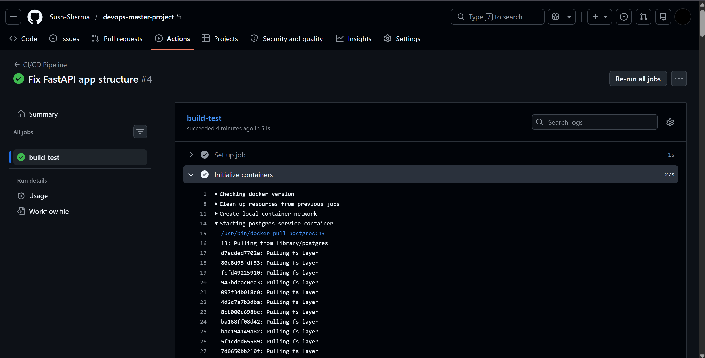
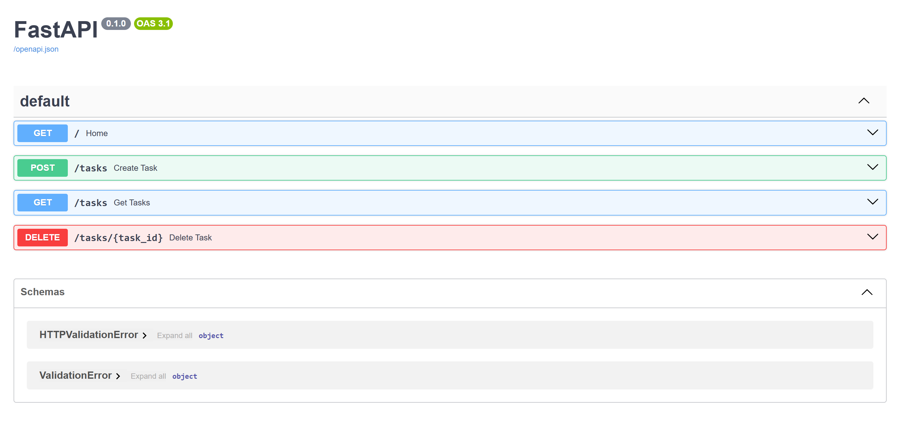

# 🚀 DevOps-Ready FastAPI Application with CI/CD

## 📌 Project Overview

This project is a production-ready backend application built using **FastAPI** and **PostgreSQL**, fully containerized using **Docker** and orchestrated with **Docker Compose**. It includes a complete **CI/CD pipeline using GitHub Actions** to automate build and validation processes.

The goal of this project was not just to build an API, but to simulate real-world DevOps practices such as containerization, service communication, environment configuration, and debugging deployment issues.

---

## 🛠️ Tech Stack

* **Backend:** FastAPI (Python)
* **Database:** PostgreSQL
* **Containerization:** Docker
* **Orchestration:** Docker Compose
* **CI/CD:** GitHub Actions

---

## ⚙️ Features

* REST API with CRUD operations
* PostgreSQL database integration
* Multi-container setup using Docker Compose
* Environment-based configuration
* Health check endpoint
* Logging support
* Automated CI pipeline:

  * Install dependencies
  * Run application validation
  * Build Docker image

---

## 📂 Project Structure

```
devops-master-project/
│── app/
│   ├── main.py
│   ├── models.py
│   ├── database.py
│── .github/workflows/
│   └── ci.yml
│── Dockerfile
│── docker-compose.yml
│── requirements.txt
│── .env
```

---

## 🚀 How to Run Locally

### 1. Clone the repository

```
git clone <https://github.com/Sush-Sharma>
cd devops-master-project
```

### 2. Start the application

```
docker-compose up --build
```

### 3. Access the API

* App: http://localhost:8000
* Health Check: http://localhost:8000/health

---

## 🔄 CI/CD Pipeline

This project includes a GitHub Actions workflow that:

* Sets up Python environment
* Installs dependencies
* Spins up PostgreSQL service
* Validates application import
* Builds Docker image

This ensures that every push to the repository is automatically tested and verified.

---

## 🐳 Docker Architecture

The application uses a multi-container setup:

* **App Container** → FastAPI service
* **DB Container** → PostgreSQL database

Both services communicate using Docker internal networking.

---

## 🧠 Challenges & Learnings

* Resolved container networking issues by using service names instead of localhost
* Fixed database connection timing issues using health checks and wait strategies
* Debugged CI pipeline failures due to environment differences
* Improved application reliability by moving DB initialization to startup events

---

## 📸 Screenshots

### CI Pipeline


### Application Running


---

## 🎯 Key Highlights

* Production-style containerized architecture
* Real-world debugging experience
* CI/CD integration from scratch
* Focus on deployment and reliability

---

## 👨‍💻 Author

Sushant Sharma

---
